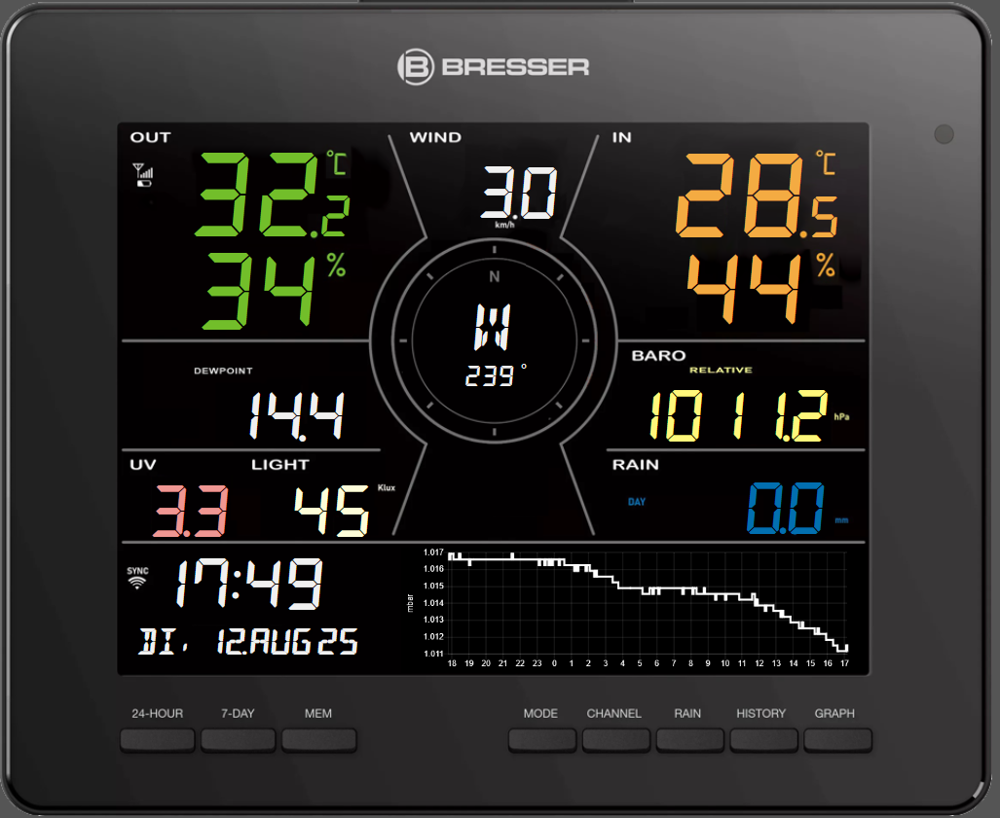

# Bresser_4CAST-for-VIS2
Bresser_4CAST for VIS2

Dieses VIS2 view für iobroker simulliert eine Bresser 4Cast MD Wetterstation (Art.Nr. 7003800).
Sie blendet Daten aus dem iobroker über eine Grafikdatei der Wetterstation Bresser_4CAST ein.
Die Daten werden aus dem Objekttree des Projektes WLAN Wetterstation übernommen.

"widgetSet": "materialdesign"
